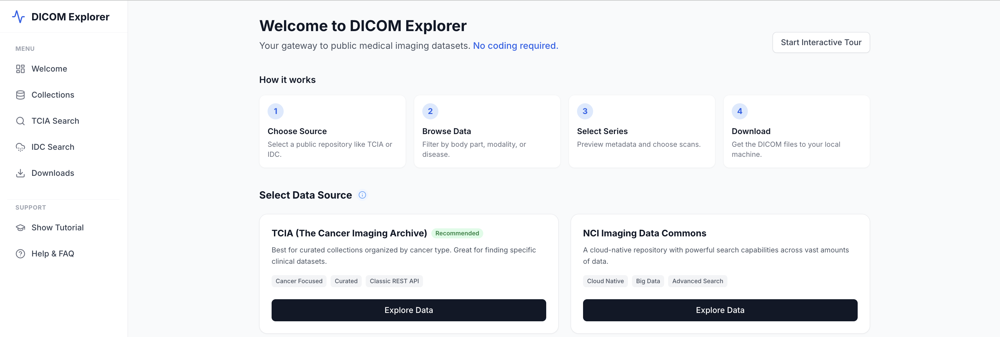
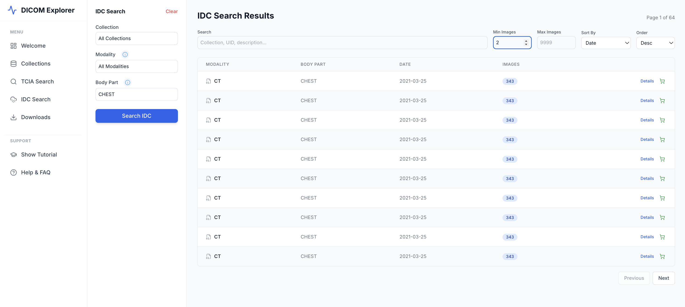
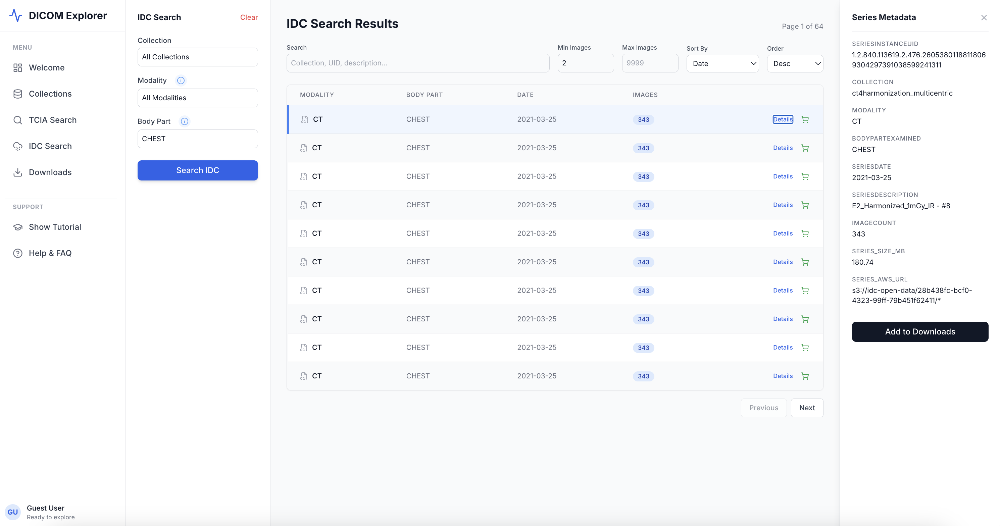
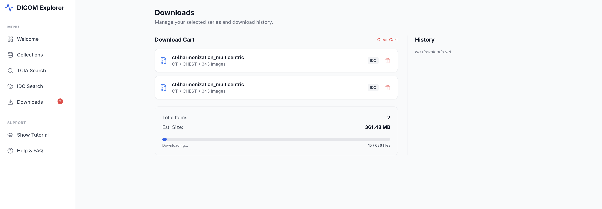

# DICOM data explorer - intro

## App Overview

This app helps you explore public DICOM datasets, inspect series metadata, and download image files to your local machine.

### Landing Page
The welcome screen introduces the workflow and guides you to the search pages.



### IDC Search
Search IDC collections by filters, browse results, and add series to the download cart.



### Series Metadata
Inspect detailed series metadata before downloading.



### Download Flow
Review your cart and start downloads with progress feedback.



## Design Document

We’ve added a software design document to share the architecture and roadmap. Please reference it and join the open-source development efforts.

[docs/DICOM Data Explorer (Intro) — Software Design Document.pdf](docs/DICOM%20Data%20Explorer%20(Intro)%20%E2%80%94%20Software%20Design%20Document.pdf)

## Getting Started

This project is managed with [Poetry](https://python-poetry.org/).

### Prerequisites

- Python 3.11.x
- Poetry

### Installation

1. Ensure Poetry uses Python 3.11:

```bash
poetry env use python3.11
poetry env info
```

2. Install dependencies:

```bash
poetry install
```

### Running the App

Start the development server:

```bash
poetry run ./reflex_rerun.sh
```

The application will be available at `http://localhost:3000`.
